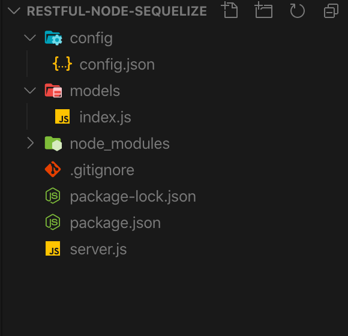
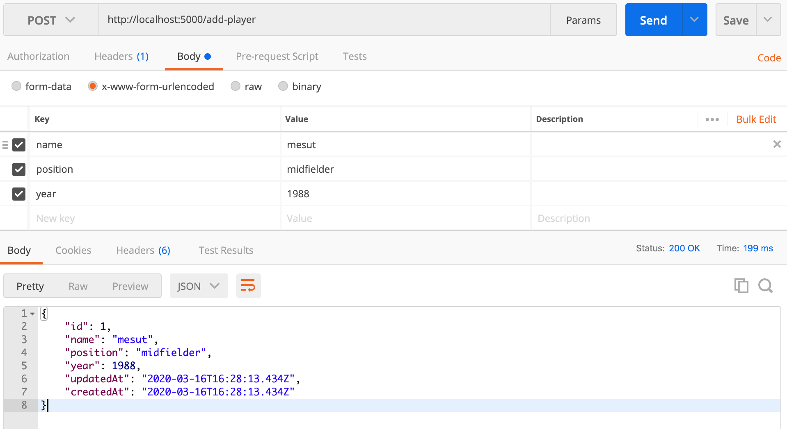
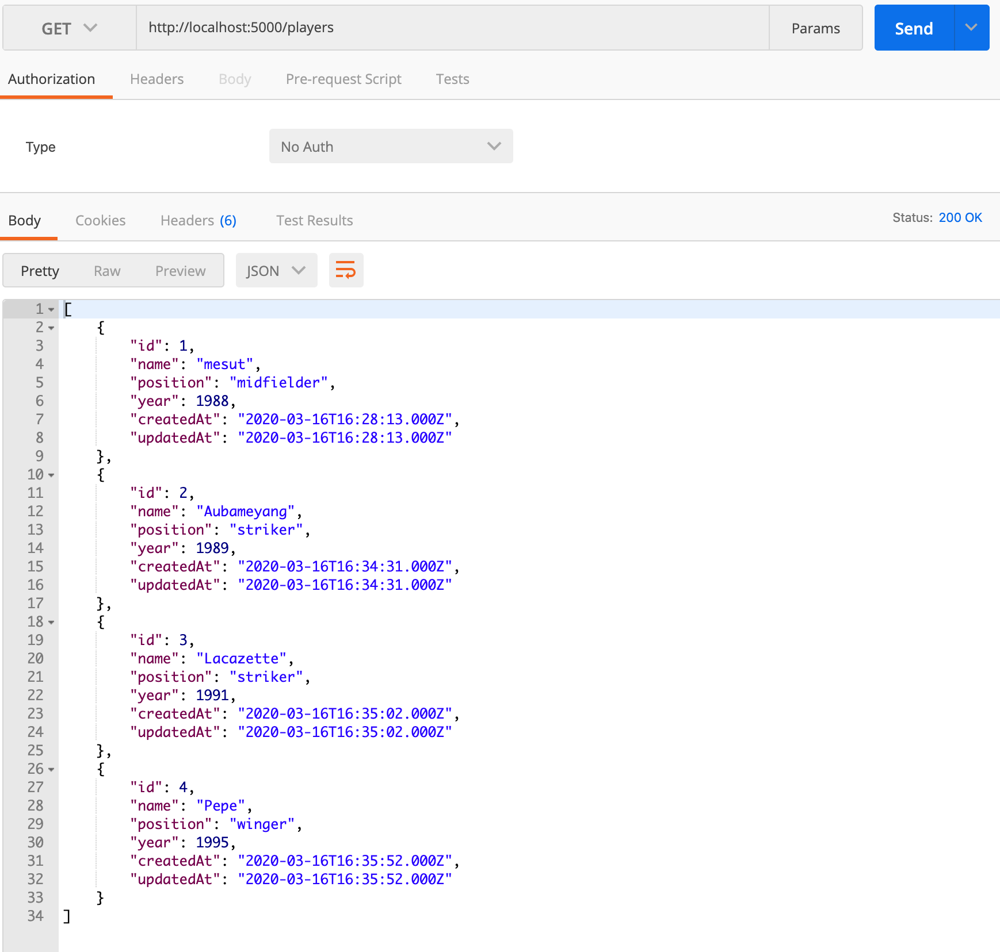
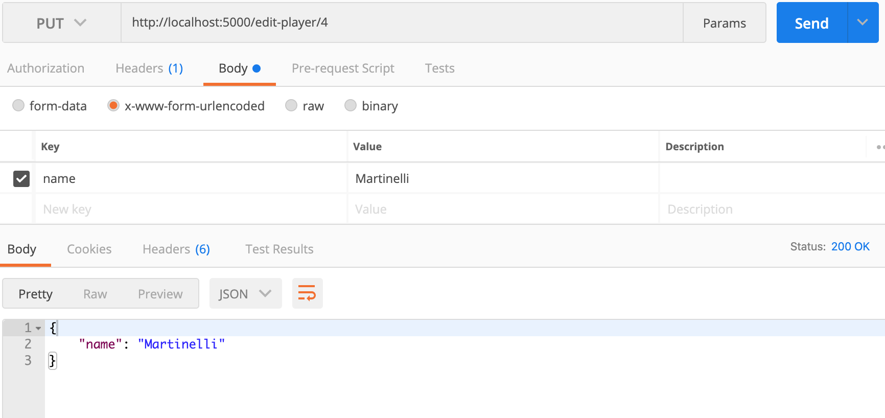
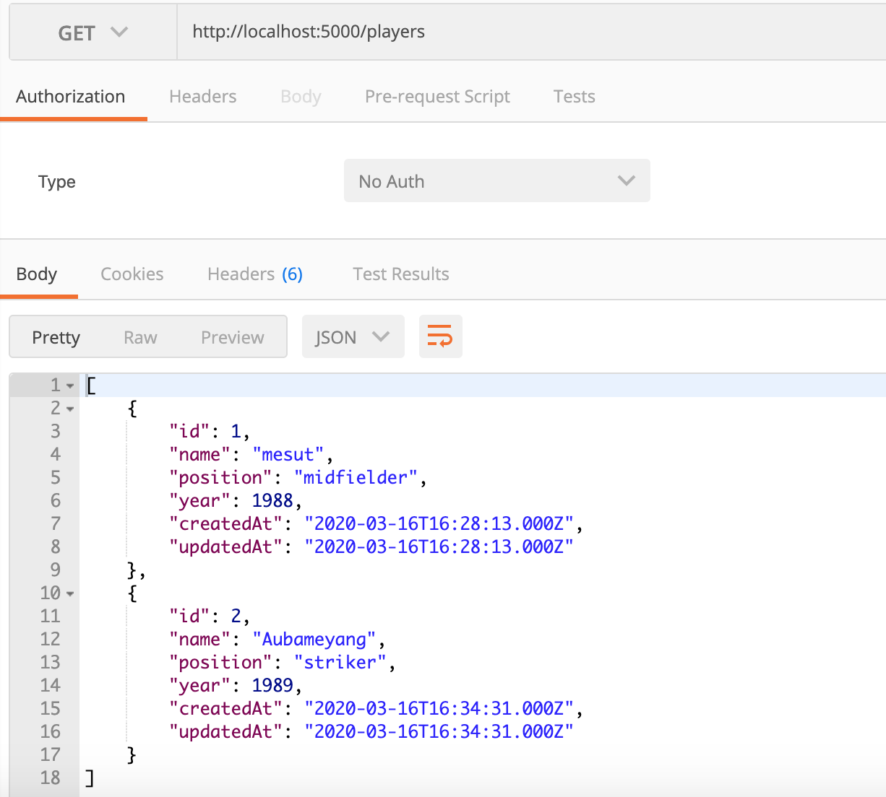

สวัสดีครับผมมมม วันนี้จะขอนำเสนอบทความเกี่ยวกับการใช้ node.js ควบคู่กับ Sequelize.js ซึ่งเป็น Object Relational Mapping (ORM) ที่เป็นที่นิยมตัวนึงสำหรับไว้จัดการฐานข้อมูลที่เป็นแบบ Relational Database โดยผมจะแสดงการเชื่อมต่อระหว่าง express web server กับ sequelize แบบง่าย ๆ ก่อนนะครับ

[Github Repository](https://github.com/xeusteerapat/node-sequelize-rest-api)

_คำเตือน บทความนี้ผมเขียนเพื่อทบทวนสิ่งที่ได้เรียนใน coding bootcamp นะครับ ผิดพลาดประการใด สามารถ ping ผมได้ที่ twitter เลยนะครับ_

## Prerequisite

- Asynchronous JavaScript (Promise)
- Basic Node.js/Express.js
- พื้นฐานด้าน database นิดหน่อย

เริ่มกันเลยดีกว่าครับ

## Create project

สร้าง directory สำหรับ project ของเราก่อน

```bash
mkdir restful-node-sequelize && cd restful-node-sequelize
```

Initialize package ของเราก่อน

```bash
npm init -y
```

ติดตั้ง dependencies ดังต่อไปนี้

```bash
npm i express body-parser mysql2 sequelize --save
```

ติดตั้ง `nodemon` สำหรับไว้ restart server แบบ automatic

```bash
npm i -D nodemon
```

แก้ไขคำสั่ง `script` ใน `package.json` นิดหน่อยครับ เพื่อที่เราจะได้ run คำสั่ง start server โดยให้เป็นดังนี้

```javascript
 "scripts": {
    "dev": "node server.js"
  }
```

เราจะได้ `package.json` ออกมาหน้าแบบนี้

```javascript
{
  "name": "restful-node-sequelize",
  "version": "1.0.0",
  "description": "",
  "main": "index.js",
  "scripts": {
    "dev": "nodemon server.js"
  },
  "keywords": [],
  "author": "",
  "license": "ISC",
  "dependencies": {
    "body-parser": "^1.19.0",
    "express": "^4.17.1",
    "mysql2": "^2.1.0",
    "sequelize": "^5.21.5"
  },
  "devDependencies": {
    "nodemon": "^2.0.2"
  }
}
```

สร้างไฟล์​ `server.js` สำหรับไว้ run server ของเราครับ

คราวนี้ก็สร้าง express server app ของเราก่อน

## Create Express server

```javascript
const express = require("express")
const app = express()

app.listen(5000, () => {
  console.log("Server listening on port 5000...")
})
```

run command `npm run dev` ที่ terminal ของเราดูครับ ถ้าได้แบบข้างล่าง ก็โอเคละครับบบบ

```bash
[nodemon] 2.0.2
[nodemon] to restart at any time, enter `rs`
[nodemon] watching dir(s): *.*
[nodemon] watching extensions: js,mjs,json
[nodemon] starting `node server.js`
Server listening on port 5000...
```

## Create Database Models

กลับมาที่ sequelize กันบ้าง เราต้องติดตั้ง library เพิ่มเติมคือ sequelize-cli สำหรับไว้เป็นตัวช่วย config ค่าต่าง ๆ ของ database ของเรา เพื่อให้สามารถจัดการ code ของ database ได้ง่ายขึ้น

```bash
npm i -g sequelize-cli
```

เมื่อติดตั้งเสร็จเรียบร้อยแล้ว ให้ใช้คำสั่ง `init:config` เพื่อสร้าง configuration file ขึ้นมา

```bash
sequelize init:config
```

เราก็จะได้ `config.json` ไฟล์ใน folder `config` ออกมาหน้าตาเป็นแบบนี้

```javascript
{
  "development": {
    "username": "root",
    "password": null,
    "database": "database_development",
    "host": "127.0.0.1",
    "dialect": "mysql",
    "operatorsAliases": false
  },
  "test": {
    "username": "root",
    "password": null,
    "database": "database_test",
    "host": "127.0.0.1",
    "dialect": "mysql",
    "operatorsAliases": false
  },
  "production": {
    "username": "root",
    "password": null,
    "database": "database_production",
    "host": "127.0.0.1",
    "dialect": "mysql",
    "operatorsAliases": false
  }
}
```

เราจะแก้ไขบางส่วนคือ password, database แล้วก็เพิ่ม timezone เข้าไปด้วยครับ จะได้

```javascript
    "password": *****, //  แล้วแต่ว่าตั้ง password ยังไงนะครับ
    "database": "football_team",
    "timezone": "+07:00"
```

ต่อไปก็ทำการสร้าง models การเก็บข้อมูลของเราครับ

```bash
sequelize init:models
```

เราจะได้ folder `models` พร้อมกับ file `index.js` เพื่อที่เราจะได้เรียกใช้ตอนที่ทำการ connect เข้ากับ server ของเราครับ



ทำการสร้างไฟล์ขึ้นมาครับคือ `player.js` ใน folder `models` โดยที่ในไฟล์ `player.js` เราจะทำการ define structure ของ table รวมถึงกำหนดชื่อ columns และ property ต่าง ๆ ดังต่อไปนี้ครับ

- สร้าง table ชื่อ `player`
- โดยมี property:
  - name รับค่าเป็น `STRING`
  - position รับค่าเป็น `STRING`
  - year รับค่าเป็น `INTEGER`

```javascript
module.exports = (sequelize, DataTypes) => {
  let player = sequelize.define("player", {
    name: {
      type: DataTypes.STRING(100),
    },
    position: {
      type: DataTypes.STRING(100),
    },
    year: {
      type: DataTypes.INTEGER,
    },
  })
  return player
}
```

ทีนี้ก็ทำการสร้าง database โดยใช้คำสั่ง

```bash
sequelize db:create
```

ถ้าได้แบบข้างล่างก็คือว่าโอเคครับบ

```bash
Sequelize CLI [Node: 13.7.0, CLI: 5.5.1, ORM: 5.21.5]

Loaded configuration file "config/config.json".
Using environment "development".
(node:13477) [SEQUELIZE0004] DeprecationWarning: A boolean value was passed to options.operatorsAliases. This is a no-op with v5 and should be removed.
Database football_team created.
```

## Connecting database to server

กลับมาที่ server ของเราอีกครั้งนะครับ ทีนี้เราต้องทำการเชื่อมต่อกับ database ของเรา โดยอาศัยชุด code ที่ถูกเขียนไว้ใน `models/index.js` ซึ่งเราต้องทำการ import มาที่ `server.js` ก่อน ก็จะเขียนประมาณนี้ครับ

```javascript
const express = require("express")
const db = require("./models") // import db from models/index.js
const app = express()

db.sequelize.sync().then(() => {
  app.listen(5000, () => {
    console.log("Server is running on port 5000")
  })
})
```

ถ้ากลับไปเช็คที่ terminal จะเห็นว่า server ของเราเชื่อมต่อกับ database ได้แล้ววววว


## Working with HTTP methods

REST หรือ Representational State Transfer คือวิธีในการสร้าง Web Service ประเภทหนึ่งที่อาศัย HTTP Methods (GET, POST, PUT, DELETE) ในการทำงาน และส่งผลกลับมาในรูปแบบของ JSON โดยสามารถรับส่งข้อมูลไปมาข้าม Platform ได้อย่างสะดวก ซึ่งในแต่ละ methods เราจะทำการสร้างความสัมพันธ์กับ database ดังต่อไปนี้

### POST method

เนื่องจาก database ของเรายังไม่มีอะไร ดังนั้นผมจะทำการสร้างข้อมูลลงไปก่อนนะครับ แบบนี้

```javascript
const express = require("express")
const bodyParser = require("body-parser")
const db = require("./models") // import db from models/index.js
const app = express()

app.use(bodyParser.json())
app.use(bodyParser.urlencoded({ extended: false }))

// add new player to database with POST method
app.post("/add-player", (req, res) => {
  let newPlayer = {
    name: req.body.name,
    position: req.body.position,
    year: Number(req.body.year),
  }
  db.player
    .create(newPlayer)
    .then(result => res.status(200).send(result))
    .catch(err => res.status(400).send(err))
})

db.sequelize.sync().then(() => {
  app.listen(5000, () => {
    console.log("Server is running on port 5000...")
  })
})
```

ทีนี้เราจะใช้ tool อย่าง "Postman" เพื่อช่วยเราทำ post request ครับ ทำการเพิ่ม player เข้าไป ก็จะได้ประมาณนี้



เรายังสามารถเช็ค database ของเรา ผ่านทาง `mysql-cli` ใน terminal หรือใครจะเช็คจาก mySQL workbench ก็ได้เหมือนกันครับ เราสามรถเรียกดู table ที่สร้างไว้โดยใช้คำสัง SQL ปกติได้เลยครับ (ผมเพิ่มเข้าไปอีก 3-4 จะได้ดูมีข้อมูลหน่อย)

```bash
mysql -u root -p
// จากนั้นก็ใส่ password ลงไป
```

ลองใช้คำสั่ง `SELECT * FROM football_team.players` ดู ก็จะได้แบบนี้


### GET method

`GET` method ก็คือการที่ให้เว็บแสดงข้อมูลตามที่มีการ request เข้ามาตาม url ที่ระบุไว้ ในที่นี้ผมจะให้เป็น `/players` นะครับ ก็ใช้ postman เหมือนเดิม แต่เปลี่ยนเป็น GET method ก็จะได้ players ทั้งหมดที่สร้างไว้ตั้งแต่ตอนแรกครับ

```javascript
app.get("/players", (req, res) => {
  db.player.findAll().then(result => res.status(200).send(result))
})
```



### PUT method

ถ้าเราอยากจะเปลี่ยนแปลงข้อมูลของเรา ก็สามารถทำได้โดยใช้ PUT method ครับ ผมจะเปลี่ยนโดยอ้างอิงจาก id ของข้อมูลเป็นหลักนะครับ โดยจะเปลี่ยนชื่อของ player ก็สามารถทำได้แบบนี้

```javascript
app.put("/edit-player/:id", (req, res) => {
  db.player
    .update({ name: req.body.name }, { where: { id: Number(req.params.id) } })
    .then(() => res.status(200).send(req.body))
})

db.sequelize.sync().then(() => {
  app.listen(5000, () => {
    console.log("Server is running on port 5000...")
  })
})
```

เหมือนเดิมครับใช้ postman แต่เปลี่ยนเป็น put method แล้วใส่ endpoint ตาม code ของเรา ลองเปลี่ยนค่าจาก Pepe เป็น Martinelli ดู



แล้วทีนี้ลองเช็ค GET method เพื่อเรียกรายชื่อ player ออกมาอีกที จะเห็นว่า Martinelli ไปแทนที่ Pepe เรียบร้อย


### DELETE method

Method สุดท้ายก็ตรงตัวเลยครับ ลบข้อมูลออกจาก database ของเรา วิธีการก็คล้าย ๆ กับ PUT method ซึ่งผมจะลบโดยอ้างอิงจาก id เป็นหลัก

```javascript
app.delete("/delete-player/:id", (req, res) => {
  db.player
    .destroy({ where: { id: Number(req.params.id) } })
    .then(() => res.send("Player deleted!"))
})
```

ก้จะได้ผลลัพธ์ใน postman ดังนี้ครับ


พอเช็คจำนวน player ที่เหลืออยู่ใน database จาก GET method ก็จะเหลืออยู่แแค่นี้ (ผมลบตัวอื่นออกไปด้วยจนเหลือแค่ 2 คน)



ซึ่งก็ตรงตามใน table ของ mySQL ครับ


คร่าว ๆ ก็จะประมาณนี้นะครับ ยังมี concept บางตัวที่ผมยังไม่เข้าใจครบถ้วน 100% ยังอธิบายได้ไม่ค่อยดีเท่าไหร่ โดยเฉพาะ ORM Concept และ REST API Concept ก็ขออภัยด้วยนะครับ ถ้าเจออะไรเพิ่มเติม จะกลับมาเขียนเพิ่มครับผมมมม

Happy Coding :)
