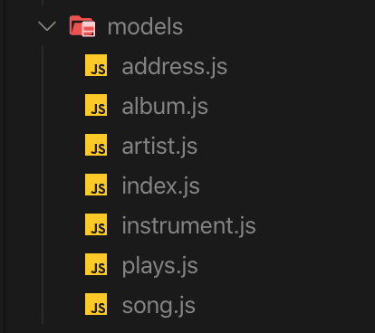

ต่อเนื่องจาก [blog ที่แล้วนะครับ](https://xeusteerapat.github.io/blog/node-sequelize-rest-api) ผมก็ได้เขียนเกี่ยวกับการทำงานระหว่าง Node.js กับ Sequelize.js ซึ่งเอาไว้จัดการกับ database แบบที่มี table เดียวแบบง่าย ๆ ว่าต้องทำเบื้องต้นอย่างไรบ้าง คราวนี้ผมจะลองเขียนกับ database ที่มีความซับซ้อนมากขึ้นอีกหน่อย โดยจะมี ER Diagram ดังรูปข้างล่างครับ


สำหรับท่านที่เซียนแล้วอาจจะเห็นว่าไม่เท่าไหร่ แต่ผมมือใหม่ไง 555555 ก็คิดว่ามันดูซับซ้อนแหละ อย่างน้อยก็เยอะกว่า blog ที่แล้ว ส่วนใครที่ยังงงเกี่ยว ER Diagram ก็ลองศึกษาเกี่ยวกับ database เบื้องต้นมาก่อนนะครับ ทีนี้เรามาลองไล่ดูความสัมพันธ์ของแต่ละ Entity โดยความสัมพันธ์แต่ละแบบจะเป็นตัวกำหนดว่า ฝั่งไหนจะเก็บ foreign key ของอีกฝั่ง

- Artist and Address เป็นแบบ **Many-to-One** ดังนั้น `addressId` ต้องเป็น foreign key ของ table `artist`
- Artist and Album เป็นแบบ **One-to-Many** ดังนั้น `artistId` ต้องเป็น foreign key ของ table `album`
- Album and Song เป็นแบบ **One-to-Many** ดังนั้น `albumId` ต้องเป็น foreign key ของ table `song`
- Artist and Song ป็นแบบ **One-to-Many** ดังนั้น `artistId` ต้องเป็น foreign key ของ table `song`
- Artist and Instrument เป็นแบบ **Many-to-Many** ดังนั้นต้องสร้าง table ขึ้นมาอีกอันนึง และเก็บค่าทั้ง `artistId` และ `instrumentId`
- Instrument and Song เป็นแบบ **Many-to-Many** ดังนั้นต้องสร้าง table ขึ้นมาอีกอันนึง และเก็บค่าทั้ง `instrumentId` และ `songId`

## Project setup

การติดตั้ง dependencies ต่าง ๆ ทำเหมือนกับ [blog ที่แล้ว](https://xeusteerapat.github.io/blog/node-sequelize-rest-api) แต่ทีนี้สิ่งที่ต่างกันก็จะเป็นในส่วนของ models ของเราครับ เพราะต้องมีไฟล์เพิ่มขึ้นมาตามตารางที่เพิ่มขึ้นครับ สร้างไฟล์ใน folder models ดังต่อไปนี้



### `address.js`

จากความสัมพันธ์พบว่ามีการเก็บค่า `addr` เพียงอย่างเดียว อ้อออ ผมลืมบอกไปว่า ถ้าเราใช้ sequelize มันจะสร้าง id ให้เราอัตโนมัติครับ เราไม่ต้องระบุลงไปใน models ดังนั้นก็จะได้ code ของ `address.js` แบบนี้

```javascript
module.exports = (sequelize, DataTypes) => {
  let address = sequelize.define('address', {
    addr: { type: DataTypes.STRING }
  });

  address.associate = models => {
    address.hasMany(models.artist);
  };

  return address;
};
```

สิ่งที่แตกต่างจาก blog ก่อนนหน้านี้ ก็คือเราต้องทำการระบุด้วยว่า `address` มีความสัมพันธ์กับตารางอื่นอย่างไรบ้าง ถ้าเลื่อนขึ้นไปดูข้างบนที่ผมอธิบายไว้ว่า Artist and Address เป็นแบบ **Many-to-One** ดังนั้น ก็จะได้เป็น `address.hasMany(models.artist)`

### `artist.js`

จาก ER เราจะเห็น artist มีความเกี่ยวข้องกับหลาย entity มาก เมื่อเราทำการ define models ก็จะได้ออกมาเป็นแบบนี้

```javascript
module.exports = (sequelize, DataTypes) => {
  let artist = sequelize.define('artist', {
    name: {
      type: DataTypes.STRING(100)
    },
    phoneNumber: {
      type: DataTypes.STRING(10)
    }
  });

  artist.associate = models => {
    artist.belongsTo(models.address);
    artist.hasMany(models.song);
    artist.hasMany(models.album);
    artist.belongsToMany(models.instrument, { through: models.play });
  };

  return artist;
};
```

จาก syntax ก็เห็นว่าค่อนข้างตรงไปตรงมากับความสัมพันธที่อธิบายไว้ข้างต้นนะครับ โดยที่ถ้าเป็น Many-to-Many ก็จะมีการเพิ่มตารางขึ้นมา `{ through: models.play }`

### `album.js`

Album มีเอี่ยวกับ Artist และ Song ก็จะเขียนได้เป็นแบบนี้

```javascript
module.exports = (sequelize, DataTypes) => {
  let album = sequelize.define('album', {
    name: {
      type: DataTypes.STRING(100)
    },
    releaseDate: {
      type: DataTypes.DATE
    }
  });

  album.associate = models => {
    album.hasMany(models.song);
    album.belongsTo(models.artist);
  };

  return album;
};
```

### `instrument.js`

instrument มีความสัมพันธ์เป็นแบบ Many-to-Many กับทั้ง Artist และ Song ดังนั้นก็จะเขียนได้เป็น

```javascript
module.exports = (sequelize, DataTypes) => {
  let instrument = sequelize.define('instrument', {
    name: {
      type: DataTypes.STRING(100)
    }
  });

  instrument.associate = models => {
    instrument.belongsToMany(models.artist, { through: models.play });
    instrument.belongsToMany(models.song, { through: 'InstrumentSong' });
  };

  return instrument;
};
```
