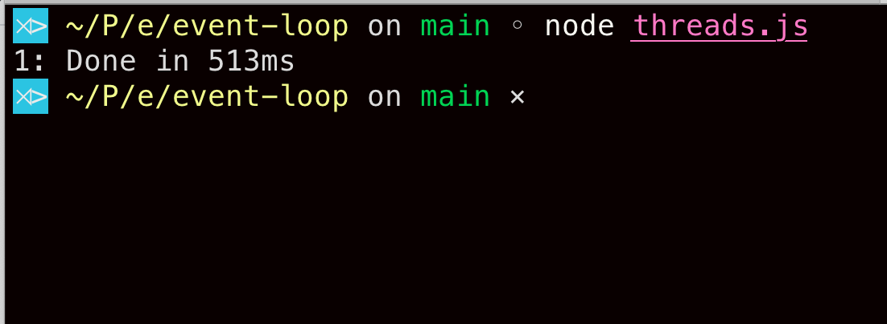
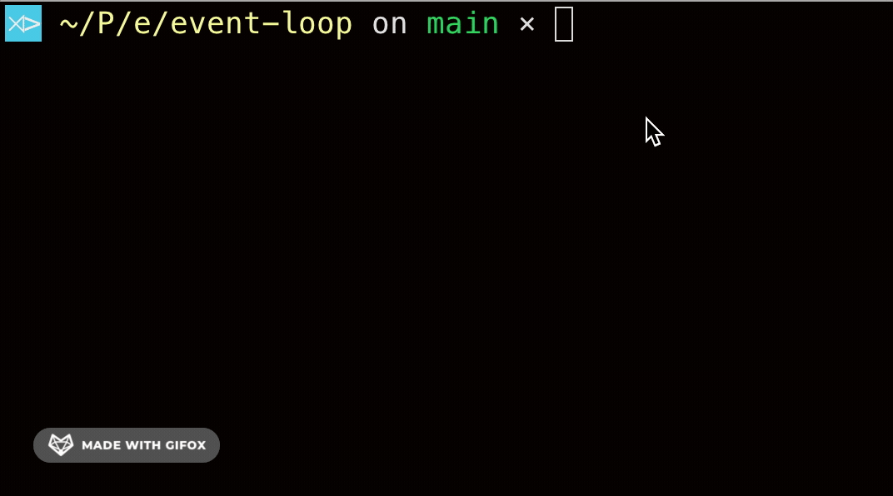
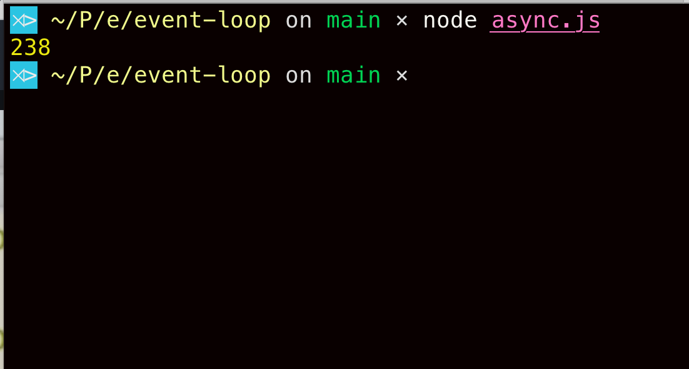

สวัสดีครับ ไม่ได้เขียน blog มานานเป็นเดือนละ เนื่องจากผมค่อนข้างยุ่งกับการเปลี่ยนงานใหม่และงานก็ค่อนข้างถาโถมเข้ามาแบบเยอะเลยทีเดียว (555) แต่ก็ยังพอมีเวลาไปศึกษา ```node.js``` เพิ่มเติมอยู่บ้าง โดยเฉพาะการทำงานภายในของตัว ```node.js``` เอง ซึ่ง blog นี้ก็จะนำเสนอเกี่ยวกับ **Event Loop** ซึ่งมีบทบาทสำคัญเป็นอย่างมากในตัว ```node.js``` core หวังว่าจะเป็นประโยชน์ต่อคนที่กำลังศึกษา ```node.js``` อยู่นะครับ code และเนื้อหาหลักๆ ผมจะอ้างอิงจาก [Node JS: Advanced Concepts](https://www.udemy.com/course/advanced-node-for-developers/) ของ [Stephen Grider](https://twitter.com/ste_grider) ครับผม

## Prerequisite

- Intermediate Javascript (asynchronous, callbacks)

## What is the Event Loop?

Node.js คือ runtime environment เพื่อดำเนินการ run Javascript ฝั่ง server side เราทราบกันดีอยู่แล้วว่า Javascript ทำงานบน **Single-Threaded** ดังนั้น Event Loop คือสิ่งที่คอยจัดการ **asynchronous non-blocking I/O operations** ใน node นั่นเอง เปรียบเสมือนเป็นโครงสร้างที่ควบคุมและตัดสินใจว่าจะทำ task ใดในช่วงเวลาหนึ่งบน thread นั้นๆ ซึ่งการทำงานของ Event Loop จะทำงานอยู่บน thread เดียวโดยมีวัฏจักรการทำงานตาม diagram รูปล่าง

```bash
   ┌───────────────────────────┐
┌─>│           timers          │
│  └─────────────┬─────────────┘
│  ┌─────────────┴─────────────┐
│  │     pending callbacks     │
│  └─────────────┬─────────────┘
│  ┌─────────────┴─────────────┐
│  │       idle, prepare       │
│  └─────────────┬─────────────┘      ┌───────────────┐
│  ┌─────────────┴─────────────┐      │   incoming:   │
│  │           poll            │<─────┤  connections, │
│  └─────────────┬─────────────┘      │   data, etc.  │
│  ┌─────────────┴─────────────┐      └───────────────┘
│  │           check           │
│  └─────────────┬─────────────┘
│  ┌─────────────┴─────────────┐
└──┤      close callbacks      │
   └───────────────────────────┘
```

*Ref: [The Node.js Event Loop, Timers, and ```process.nextTick()```](https://nodejs.org/en/docs/guides/event-loop-timers-and-nexttick/)*

สมมติว่าเราเขียน code ในไฟล์ ```index.js``` แล้วเราจะใช้คำสั่ง run ```node index.js``` แต่ละช่วง Event Loop จะมีการทำงานดังต่อไปนี้

- **Timers**: เป็นการจัดการเกี่ยวกับเวลา เช่น ```setTimeout()``` หรือ ```setInterval()```
- **Pending callbacks**: เป็นช่วงที่ต้องจัดการเกี่ยวกับ callbacks ต่างๆ
- **Idle, prepare**: เป็นช่วงเวลาที่ event loop กลับไปอยู่ที่สถานะ "รอ" เพื่อให้ tasks ใดๆ ดำเนินการเสร็จ เดี๋ยวผมจะลงรายละเอียดอีกทีนะครับ
- **Poll**: จัดการเกี่ยวกับ I/O event ต่างๆ
- **Check**: ```setImmediate()``` callbacks
- **Close callbacks**: close event ต่างๆ เช่น ```socket.on('close', ...)```

ทีนี้อาจจะยังมองภาพไม่ออกว่าแต่ละช่วงนั้น Event Loop มันทำงานของมันยังไงกันแน่ ต่อไปผมจะเอาแต่ละช่วงมาเขียนเป็น psuedo code ดูนะครับ เพื่อให้เข้าใจมากขึ้น

```javascript
//----- Totally FAKE code -----//

// สมมติว่า run node index.js

// Tasks ต่างๆ ที่ Event Loop ต้องทำการตรวจสอบ
// และตัดสินใจว่าจะดำเนินการอย่างไรต่อไป
const pendingTimers = [];
const pendingOSTasks = [];
const pendingOperations = [];

// shouldContinue() คือตัวแทนการทำงานของ Event Loop
// ซึ่ง function นี้จะคืนค่า truthy หรือ falsy
function shouldContinue() {
  return (
    pendingTimers.length || pendingOSTasks.length || pendingOperations.length
  );
}

// เข้าสู่ Event Loop
while (shouldContinue()) {

}

// exit back to terminal
```

## Event Loop's phases in Detail

รายละเอียดการทำงานในแต่ละช่วงของ Event Loop มีดังนี้

1. **Event Loop** จะตรวจสอบว่ามี  task ใน ```pendingTimers``` หรือไม่ ซึ่งก็คือ ```setTimeout()``` และ ```setInterval()``` ถ้ามี ก็จะทำการ execute callbacks function ที่อยู่ใน ```pendingTimers``` เหล่านั้น
2. ต่อไปก็คือการตรวจสอบว่ามี ```pendingOSTasks``` และ  ```pendingOperations``` อยู่หรือไม่ เช่น การเรียก ```httpServer.listen(PORT)``` หรือการเรียกใช้ file system module ```fs```
3. จากนั้น Event Loop จะเข้าสู่ **idle, prepare** รอที่จะดำเนินการต่อไปเมื่อ
    - ทำ ```pendingOSTasks``` เสร็จ
    - ทำ ```pendingOperations``` เสร็จ
    - timer ถึงเวลาที่กำหนดและดำเนินการเรียก callback function ในนั้น
4. ตรวจสอบ ```pendingTimers``` อีกครั้งและเรียก ```setImmediate``` function
5. จัดการ ```close event``` เช่น  ```socket.on('close', ...)``` หรือ ```readStream.on('close', ...)```

ถ้ามี ```pendingTask``` ใดใดสักอันหนึ่งที่มี task อยู่ข้างใน (length > 0) ```shouldContinue()``` ก็จะคืนค่าเป็น ```true``` Event Loop ก็จะดำเนินวัฏจักรของมันไปเรื่อยๆ (```while (true) {}```) จนกว่าทุก ๆ ```pendingTask``` หมดไป ```shouldContinue()``` ก็จะคืนค่าเป็น ```false``` และออกมาจาก loop นั่นเอง

## Is Node.js single-threaded?

มาถึงตรงนี้ อยากจะตั้งคำถามกับคุณผู้อ่านสักหน่อยว่า Node.js เป็น single-thread หรือไม่?

คำตอบคือ...

***ทั้งใช่ และไม่ใช่...***

เริ่มงงกันแล้วใช่มั้ยครับ 555

ผมจะแบ่งเป็น 2 ประเด็นหลักๆ ละกันนะครับ

1. ถ้าเป็นตัว Event Loop - ใช่ครับ มันทำงานอยู่บน single-threaded
2. แต่ถ้าเป็น module หรือ standard library บางตัวของ เช่น `fs, crypto, zlib` - ไม่ใช่ single-threaded ครับ

บางคนอาจจะสงสัย ว่าอ้าว javascript เป็น single-threaded นี่ node เองก็ใช้ javascript แล้วทำไมไม่ใช่ single-thread ทั้งหมดล่ะ

ลองมาดูตัวอย่างกันครับ

```javascript
// thread.js
const { pbkdf2 } = require('crypto');

const start = Date.now();

pbkdf2('pwd', 'salt', 100000, 512, 'sha512', () =>
  console.log(`1: Done in ${Date.now() - start}ms`)
);
```

`pdkdf2` เป็น function ที่ใช้ทำการเข้ารหัส ในตัวอย่างจะใช้ `sha512` เป็น secure hash algorithm ทีนี้ลอง run `node thread.js` ดูครับ ก็จะได้ผลลัพธ์ประมาณนี้



ทีนี้ลองเพิ่มไปอีก 3 ชุดคำสั่ง

```javascript
const { pbkdf2 } = require('crypto');

const start = Date.now();

pbkdf2('pwd', 'salt', 100000, 512, 'sha512', () =>
  console.log(`1: Done in ${Date.now() - start}ms`)
);

pbkdf2('pwd', 'salt', 100000, 512, 'sha512', () =>
  console.log(`2: Done in ${Date.now() - start}ms`)
);

pbkdf2('pwd', 'salt', 100000, 512, 'sha512', () =>
  console.log(`3: Done in ${Date.now() - start}ms`)
);

pbkdf2('pwd', 'salt', 100000, 512, 'sha512', () =>
  console.log(`4: Done in ${Date.now() - start}ms`)
);
```

แล้ว run ดูอีกครั้งครับจะได้


อ้าววววว ทำไมเหมือนกับว่าเกิดขึ้นพร้อมกันเลยล่ะ? ถ้า node เป็น single-threaded จริง มันต้องทำตามลำดับ 1 --> 2 --> 3 --> 4 ใช้มั้ยครับ ดูจากรูปผม run หลายๆ ครั้งให้ดูเลย เพื่อให้เห็นชัดเจนว่ามันเกิดขึ้น ๆ พร้อมๆ กัน

สาเหตุที่เป็นแบบนี้ ก็เพราะว่า standard module บางตัว (เช่น crypto) ที่มีการใช้ cpu ประมวลผลสูง node จะไม่ได้ run แค่ single-threaded แต่จะอาศัยตัวช่วยอย่าง [uv thread pool](http://docs.libuv.org/en/v1.x/threadpool.html) โดยที่ค่าเริ่มต้นของ `uv_thread_pool` ก็คือ 4 ถ้าเราอยากให้มัน run แค่ thread เดียว ก็สามารถทำได้แบบนี้ครับ

```javascript
// กำหนด UV_THREADPOOL_SIZE แบบนี้
// ใส่ไว้ข้างบนสุดของ code เมื่อกี้
process.env.UV_THREADPOOL_SIZE = 1;
```

แล้วทีนี้ลอง run ดูอีกครั้งครับ ผลที่ได้คือ



ถ้าลองไปอ่านที่ [doc](http://docs.libuv.org/en/v1.x/threadpool.html) ของ libuv จะพบว่าเราสามารถกำหนด `UV_THREADPOOL_SIZE` ได้ถึง 1024 ลองไปเล่นๆ กันดูได้ครับ สรุปคือ node จะใช้ Event Loop บน main thread และจะมี threadpool จาก libuv เอาไว้คอยจัดการพวก cpu intensive task

## OS Operations

ต่อไปก็มาทำความเข้าใจเกี่ยวกับ `os operations` หรือ `pendingOSTasks` ที่ผมเขียนไว้ใน psuedo code ตัวอย่างนะครับ ซึ่งเป็นอีกตัวที่น่าสนใจเช่นกัน ลองดู code ตัวอย่างกันครับ

```javascript
// async.js
const https = require('https')

const start = Date.now()

function doRequest() {
  https
    .request('https://www.google.com', res => {
      res.on('data', () => {});
      res.on('end', () => {
        console.log(Date.now() - start);
      });
    })
    .end();
}

doRequest()
```

แล้ว run `node async.js` จะได้เป็น



ทีนี้ลองเพิ่มการเรียก function `doRequest()` ให้เป็นสัก 7 ครั้ง

```javascript
doRequest()
doRequest()
doRequest()
doRequest()
doRequest()
doRequest()
```


อ้าวววว เรียกไปตั้ง 6 ครั้ง แต่ก็ run พร้อมๆ กันแหะ! ยังไงเนี่ยยยย

คำตอบก็คือเมื่อมีการทำ network request แบบ code ข้างบน node จะไม่ได้ใช้ `UV_THREADPOOL` แต่จะไปเรียกใช้ **asynchronous interface** ซึ่งแต่ละระบบปฏิบัติการมีให้อยู่แล้วแทน ถ้าเป็น linux ก็จะเป็น [AIO](https://man7.org/linux/man-pages/man7/aio.7.html) เป็นต้น

หวังว่าจะช่วยคลายข้อสงสัยเกี่ยวกับการทำงานของ Event Loop ไม่มากก็น้อยนะครับ ถ้ามีเวลา ผมจะมาเขียนเกี่ยวกับสิ่งที่น่าสนใจของ Node.js อีกเรื่อยๆ นะครับ

Happy Coding :)

## References

- [Node JS: Advanced Concepts](https://www.udemy.com/course/advanced-node-for-developers/)
- [Thread pool work scheduling](http://docs.libuv.org/en/v1.x/threadpool.html)
- [All you need to know to really understand the Node.js Event Loop and its Metrics](https://www.dynatrace.com/news/blog/all-you-need-to-know-to-really-understand-the-node-js-event-loop-and-its-metrics/#disqus_thread)
- [The Node.js Event Loop, Timers, and `process.nextTick()`](https://nodejs.org/en/docs/guides/event-loop-timers-and-nexttick/)
- [Morning Keynote- Everything You Need to Know About Node.js Event Loop - Bert Belder](https://www.youtube.com/watch?v=PNa9OMajw9w)
